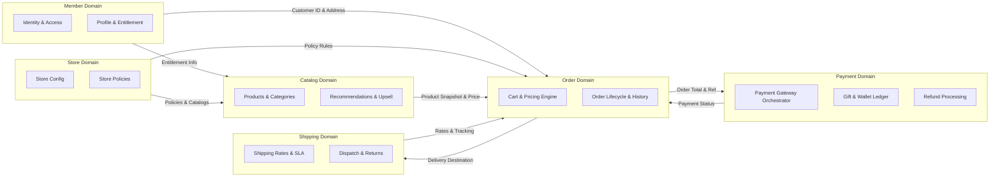

# Backend Requirements & Architectural Specifications

This document outlines the reverse-engineered backend requirements, domain models, business capabilities, and specifications derived from the E-Commerce Bookstore architecture diagram.

---

## 1. Functional Requirements

### 1.1 Member & Identity Management (Member Domain)
- **User Registration & Account Management:**
  - Support registration for new customers with unique identity validation (email/username, password, contact details).
  - Manage user profiles, contact information, default billing, and shipping addresses.
- **Authentication & Session Lifecycle:**
  - Secure credential-based login and logout for registered users.
  - Token-based or session-based state management (JWT / OAuth2 / OIDC).
  - Support anonymous/guest user sessions with persistent carts convertible to registered accounts upon login/checkout.
- **Access Control & Entitlement:**
  - Role-based access control (RBAC) supporting Customer, Guest, Store Administrator, Catalog Manager, and Support Agent roles.
  - User entitlement engine to control catalog visibility, tier-based pricing, and promotion eligibility.

### 1.2 Store & Multi-Tenant Management (Store Domain)
- **Store Setup & Configuration:**
  - Creation and maintenance of multiple store instances / storefront profiles.
  - Configuration of store metadata (currency, default locale, time zone, supported regions, contact details).
- **Catalog-to-Store Association:**
  - Capability to assign master and sales catalogs to specific store entities.
- **Store Policy Management:**
  - Definition and enforcement of store-level operational policies: return policies, cancellation windows, shipping restrictions, tax policies, and discount rules.

### 1.3 Catalog, Product & Recommendation Management (Catalog Domain)
- **Product & Category Hierarchy:**
  - Hierarchical category taxonomy (e.g., Genres, Formats: Hardcover, Paperback, eBook, Audio, Subjects).
  - Product attribute management (Title, Author/Brand, ISBN, Publisher, Publication Date, Description, Price, Stock Status, Images).
- **Entitlement-Based Browsing & Search:**
  - Filter and display catalog items based on user entitlements, store assignment, and regional availability.
  - Multi-faceted search and filtering by Category, Author/Brand, Price Range, Ratings, and Availability.
- **Personalized Recommendations:**
  - Rule-based and history-driven recommendation engine (based on user purchase history, recent views, and preferences).
- **Cross-Selling & Up-Selling:**
  - Automated association and display of related products (e.g., box sets, companion guides, author bundles, higher-edition hardcovers).

### 1.4 Cart & Order Processing (Order Domain)
- **Shopping Cart Management:**
  - Add, update quantity, remove, and persist items in cart for both Guest and Registered users.
  - Seamless merge of guest carts into registered user carts post-authentication.
  - Real-time price validation and inventory reservation checks.
- **Discounts, Coupons & Rewards Redemption:**
  - Validation and application of promotional coupon codes.
  - Loyalty/Gift points redemption against order totals.
- **Order Lifecycle Management:**
  - Order creation, checkout orchestration, status transitions (`Created`, `Pending_Payment`, `Confirmed`, `Processing`, `Shipped`, `Delivered`, `Cancelled`, `Return_Requested`, `Returned`).
  - Order cancellation within permissible policy windows.
  - Return order initiation, tracking, and item restocking triggers.
- **Order History & Tracking:**
  - Detailed historical orders listing with itemized breakdowns, invoices, and shipment tracking links.

### 1.5 Payment & Wallet Management (Payment Domain)
- **Payment Processing & Gateway Integration:**
  - Orchestration with external Payment Service Providers (PSP) for Credit/Debit Cards, Net Banking, and digital payment methods.
  - Secure two-way payment confirmation and transaction verification (webhooks and polling verification).
- **Wallet & Gift Balances:**
  - Internal customer wallet management (balance top-up, deduction, transaction ledger).
  - Digital gift card issuance, validation, and balance redemption.
- **Refund Processing:**
  - Automated and manual refund initiation for cancelled orders and approved returns.
  - Ledger tracking for partial and full refunds to source payment methods or store wallet.

### 1.6 Shipping & Fulfillment (Shipping Domain)
- **Shipping Rate Calculation:**
  - Dynamic rate calculation based on destination postal code, package weight/dimensions, and delivery tier (Standard, Express, Overnight).
- **Delivery Timeline Estimation:**
  - Calculation and presentation of estimated delivery dates (EDD) based on warehouse proximity, carrier SLAs, and handling time.
- **Return Shipment Handling:**
  - Generation of reverse logistics labels and tracking return transit until arrival at the fulfillment center.

---

## 2. Non-Functional Requirements (NFRs)

| Category | Requirement Specification |
| :--- | :--- |
| **Performance & Latency** | - Catalog search & product detail pages response time $< 200\text{ ms}$ (p95).<br>- Cart operations and checkout validation $< 500\text{ ms}$. |
| **Scalability & Concurrency** | - Horizontally scalable stateless microservices.<br>- Support high concurrency during flash sales/promotions without database locking bottlenecks. |
| **Availability & Reliability** | - 99.95% system uptime.<br>- Circuit breakers, retries with exponential backoff, and graceful degradation for external dependencies (e.g., Payment Gateway, Carrier APIs). |
| **Security & Compliance** | - Zero plaintext storage of sensitive data (Passwords hashed via Argon2/BCrypt; PCI-DSS compliance by tokenizing card info).<br>- Strict RBAC and JWT-based authenticated endpoints with short-lived tokens.<br>- HTTPS/TLS 1.3 enforced for all communications. |
| **Data Consistency & Integrity**| - Eventual consistency across distributed domains via event streaming / outbox pattern.<br>- ACID transactions within bounded contexts (e.g., Order and Payment state transitions). |
| **Auditability & Observability** | - Centralized logging, distributed tracing (e.g., OpenTelemetry), and metrics collection (Prometheus).<br>- Immutable audit trails for financial transactions, refunds, and order status changes. |

---

## 3. User Roles

```
 ┌─────────────────────────────────────────────────────────────┐
 │                         User Roles                          │
 ├───────────────────┬───────────────────┬─────────────────────┤
 │    Customer       │      Customer     │   Administrative    │
 │    (Guest)        │   (Registered)    │       Roles         │
 ├───────────────────┼───────────────────┼─────────────────────┤
 │ • Browse Catalog  │ • All Guest Perms │ • Store Admin       │
 │ • Manage Temp Cart│ • Profile & Wallet│ • Catalog Manager   │
 │ • Guest Checkout  │ • Order History   │ • Support / Ops     │
 └───────────────────┴───────────────────┴─────────────────────┘
```

1. **Guest User:**
   - Unauthenticated visitor.
   - Can browse products, view details, search, add items to a temporary cart, and initiate guest checkout.
2. **Registered User / Member:**
   - Authenticated shopper.
   - Retains persisted cart across devices, accesses order history, saves addresses, uses wallet/gift points, initiates returns, and receives personalized recommendations.
3. **Catalog Manager:**
   - Back-office administrator responsible for product catalog hierarchy, ISBN details, author/brand associations, and inventory definitions.
4. **Store Administrator:**
   - System administrator configuring store metadata, regional policies, payment/shipping options, and entitlement boundaries.
5. **Customer Support / Operations Agent:**
   - Operational user authorized to inspect orders, manually trigger refunds, handle customer escalations, and manage return authorizations.

---

## 4. User Stories

### Member Domain
- **US-MEM-01:** *As a Guest User*, I want to create an account with my email and password so that I can track my orders and save my delivery details.
- **US-MEM-02:** *As a Registered User*, I want to log in securely so that I can access my saved cart, wallet balance, and order history.
- **US-MEM-03:** *As a Customer*, I want my guest cart to automatically merge into my member account upon logging in so that I do not lose my selected books.

### Store Domain
- **US-STR-01:** *As a Store Administrator*, I want to configure store policies (e.g., 14-day return window, cancellation rules) so that orders conform to regional regulations.
- **US-STR-02:** *As a Store Administrator*, I want to link specific catalogs to specific storefronts so that multi-region stores present localized offerings.

### Catalog Domain
- **US-CAT-01:** *As a Customer*, I want to browse books by categories (genres) and filter by author/brand and price so that I can quickly find the title I want.
- **US-CAT-02:** *As a Registered User*, I want to see personalized recommendations on the homepage based on my previous book purchases.
- **US-CAT-03:** *As a Customer*, I want to see cross-sell and up-sell suggestions (e.g., collector's editions, sequels) on the product detail page to discover related reads.

### Order Domain
- **US-ORD-01:** *As a Customer*, I want to add books to my cart and modify quantities so that I can prepare my purchase.
- **US-ORD-02:** *As a Customer*, I want to apply discount coupons and redeem gift points during checkout to reduce my total payable amount.
- **US-ORD-03:** *As a Registered User*, I want to view my past orders and check real-time shipment status so that I know when my package will arrive.
- **US-ORD-04:** *As a Registered User*, I want to cancel an order before it ships or initiate a return after delivery so that I can get a refund for unwanted books.

### Payment Domain
- **US-PAY-01:** *As a Customer*, I want to pay for my order using credit card or digital wallet through a secure gateway so that my payment is safely processed.
- **US-PAY-02:** *As a Customer*, I want to receive an immediate payment confirmation once the transaction is authorized.
- **US-PAY-03:** *As a Customer*, I want my refund credited back to my source payment method or store wallet when a return/cancellation is accepted.

### Shipping Domain
- **US-SHP-01:** *As a Customer*, I want to see calculated shipping fees and approximate delivery dates before completing checkout.
- **US-SHP-02:** *As a Customer*, I want to receive return shipping instructions and a tracking reference when my return request is approved.

---

## 5. Business Capabilities

```
┌──────────────────────────────────────────────────────────────────────────────────┐
│                             Bookstore E-Commerce Platform                        │
├─────────────────────┬─────────────────────┬─────────────────────┬────────────────┤
│ Customer Identity   │ Merchandising &     │ Commercial &        │ Fulfillment &  │
│ & Access            │ Content             │ Orders              │ Logistics      │
├─────────────────────┼─────────────────────┼─────────────────────┼────────────────┤
│ • Authentication    │ • Catalog Hierarchy │ • Cart Management   │ • Rate Calc    │
│ • Profile & Address │ • Search & Facets   │ • Promotion Engine  │ • SLA / EDD    │
│ • Entitlement       │ • Recommendations   │ • Checkout & Order  │ • Reverse      │
│ • Multi-tenancy     │ • Cross / Up-sell   │ • Payment & Wallet  │   Logistics    │
│   (Store Policies)  │ • Store Catalog Map │ • Refund Management │                │
└─────────────────────┴─────────────────────┴─────────────────────┴────────────────┘
```

1. **Customer Identity & Entitlement Management:** User onboarding, authentication, session tokens, profile persistence, and access tiering.
2. **Multi-Store & Policy Governance:** Storefront provisioning, regional catalog mapping, and policy lifecycle rules.
3. **Merchandising & Catalog Discovery:** Dynamic categorization, product attribution, brand/author indexing, faceted search, and AI/rule-based recommendation orchestration.
4. **Cart & Transactional Order Management:** Shopping cart state, pricing engine, promotional deductions, points redemption, and full order lifecycle state transitions.
5. **Financial & Payment Processing:** Gateway abstraction, tokenized payment authorizations, wallet ledger management, and automated refund disbursement.
6. **Fulfillment & Logistics Orchestration:** Real-time shipping rate calculation, estimated delivery time computation, tracking integration, and return logistics.

---

## 6. Domain Boundaries (Bounded Contexts)



- **Member Context:** Encapsulates identity, credentials, roles, profile details, addresses, and user entitlement groups. Independent of shopping mechanisms.
- **Store Context:** Defines physical/logical store boundaries, operational rules, and multi-tenant policies. Acts as configuration provider for other domains.
- **Catalog Context:** Owns book metadata, categories, authors, search indexing, and recommendation heuristics.
- **Order Context:** Core coordinator for cart items, pricing rules, promo codes, gift point redemptions, and order lifecycle states.
- **Payment Context:** Encapsulates financial transactions, tokenized communication with payment gateways, wallet accounts, and refund ledgers.
- **Shipping Context:** Encapsulates courier integration, carrier rates, estimated delivery calculations, and return consignment tracking.

---

## 7. Backend Modules

```
backend-root/
├── member-service/         # Authentication, Profile, Entitlements, Address Book
├── store-service/          # Store Configuration, Catalog Mappings, Store Policies
├── catalog-service/        # Categories, Books/Products, Search, Recommendations, Upsell
├── order-service/          # Cart Management, Order Orchestration, Promos & Gift Points
├── payment-service/        # Gateway Adapter, Wallet, Ledger, Refund Engine
└── shipping-service/       # Shipping Rate Matrix, Delivery Estimations, Carrier Returns
```

1. **`member-service`**:
   - Manages user lifecycle, OAuth2/JWT token signing, RBAC role validation, and address repository.
2. **`store-service`**:
   - Manages store entities, catalog bindings, and return/cancellation business policy rules.
3. **`catalog-service`**:
   - Manages book entities (ISBN, authors, genres, stock metadata), multi-facet search engine, and recommendation engine.
4. **`order-service`**:
   - Manages guest/member cart states, coupon verification, order state machine, and order history repository.
5. **`payment-service`**:
   - Handles payment gateway integrations, webhooks, transaction journals, wallet credits/debits, and refund processing.
6. **`shipping-service`**:
   - Integrates with logistics carriers to calculate delivery rates, estimate delivery timelines, and generate return labels.

---

## 8. API Domains (Categorized Capabilities)

*Note: Outlined at the domain capability level without endpoint generation as instructed.*

```
┌────────────────────────────────────────────────────────────────────────┐
│                              API Domains                               │
├────────────────────┬────────────────────┬──────────────────────────────┤
│ 1. Member APIs     │ 3. Catalog APIs    │ 5. Payment APIs              │
│    • Auth & Tokens │    • Search/Browse │    • Charge & Capture        │
│    • Profiles      │    • Product Specs │    • Webhooks & Verification │
│    • Entitlements  │    • Recs & Upsell │    • Wallet & Refunds        │
├────────────────────┼────────────────────┼──────────────────────────────┤
│ 2. Store APIs      │ 4. Order APIs      │ 6. Shipping APIs             │
│    • Store Config  │    • Cart Ops      │    • Rate Calculations       │
│    • Policy Config │    • Checkout      │    • EDD Estimates           │
│    • Catalog Maps  │    • Order History │    • Return Logistics        │
└────────────────────┴────────────────────┴──────────────────────────────┘
```

1. **Member API Domain:**
   - Identity & Token Management (Sign-up, Login, Refresh, Logout).
   - Profile & Address Book Management.
   - User Entitlement & Role Verification.
2. **Store API Domain:**
   - Store Configuration & Provisioning.
   - Store Policy Retrieval & Enforcement (Return window, regional rules).
   - Store-to-Catalog Binding.
3. **Catalog API Domain:**
   - Category Hierarchy & Navigation.
   - Product Search, Filtering, and Detail Queries.
   - Personalized Recommendations & Cross-Sell/Up-Sell Inquiries.
4. **Order API Domain:**
   - Shopping Cart Operations (Add, Update, Remove, Merge, Clear).
   - Coupon Validation & Loyalty Points Redemption.
   - Checkout Initiation, Order Lifecycle State Tracking, Order History, and Returns.
5. **Payment API Domain:**
   - Payment Intent Creation, Gateway Authorization, and Capture.
   - PSP Webhook Ingestion & Transaction Status Inquiries.
   - Wallet Balance Management & Refund Execution.
6. **Shipping API Domain:**
   - Dynamic Shipping Rate Calculation.
   - Estimated Delivery Timeline (EDD) Inquiries.
   - Return Shipment Label Generation and Transit Tracking.

---

## 9. Data Ownership Matrix

| Domain / Service | Primary Entities Owned | Read Access Needed By | Write Access Restricted To |
| :--- | :--- | :--- | :--- |
| **Member** | `User`, `Role`, `Address`, `Entitlement`, `UserSession` | Order, Catalog, Payment | Member Service |
| **Store** | `Store`, `StoreCatalogMapping`, `StorePolicy` | Catalog, Order, Shipping | Store Service |
| **Catalog** | `Category`, `Product` (Book), `Author`, `Brand`, `RecommendationRule` | Order, Member | Catalog Service |
| **Order** | `Cart`, `CartItem`, `Order`, `OrderItem`, `Coupon`, `OrderHistory` | Payment, Shipping, Member | Order Service |
| **Payment** | `PaymentTransaction`, `WalletAccount`, `WalletTransaction`, `Refund` | Order, Member | Payment Service |
| **Shipping** | `ShippingMethod`, `ShippingZone`, `ShipmentRate`, `ShipmentTracker`, `ReturnShipment` | Order | Shipping Service |

---

## 10. Assumptions

1. **Guest Checkout Data Retention:** Guest users will be identified via a temporary session/device ID, and their cart can be converted to an active order upon providing email and billing/shipping information during checkout.
2. **Payment Gateway Scope:** Actual card numbers and sensitive CVVs are directly tokenized via client-side SDKs / PSP hosted fields, so backend services only handle payment tokens, transaction IDs, and webhooks (PCI-DSS SAQ-A compliant).
3. **Recommendation Mechanism:** Initial recommendation capability uses collaborative filtering / rule-based heuristics on order history before transitioning to complex ML pipelines.
4. **Inventory Reservation Strategy:** Stock reservation is held temporarily during checkout initiation and permanently deducted upon successful payment confirmation.
5. **Communication / Notification:** Order confirmations, delivery updates, and refund notifications are dispatched asynchronously via an event-driven notification subsystem.

---

## 11. Out Of Scope Items

1. **Vendor / Marketplace Multi-Seller Portal:** Multi-seller marketplace management (e.g., third-party merchant onboarding, seller payout settlement) is excluded; the system assumes centralized inventory or direct store ownership.
2. **Warehouse Management System (WMS) Internal Operations:** Internal warehouse bin packing, physical picker routing, and warehouse inventory staging.
3. **Physical POS Integration:** Point of Sale hardware integration for physical brick-and-mortar checkout terminals.
4. **Direct In-House Payment Processing:** Handling raw credit card data or building an in-house payment processor without third-party gateways.
5. **Customer Review Moderation & Community Forums:** Advanced social features, reader forums, and video reviews are outside the primary transactional e-commerce scope.
